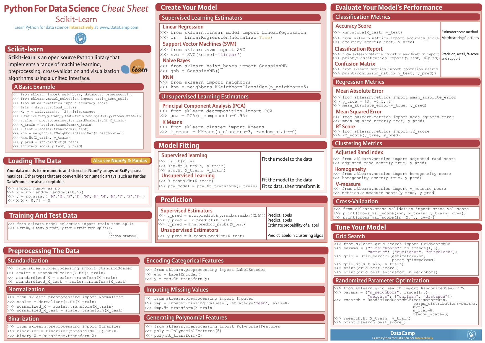

# 技術書典４用のレポジトリ

## 説明
　技術書典でデータ分析とKaggleが初めての人のための本を出す予定です。詳細は[技術書典４でKaggleと機械学習についての本を出します。](http://www.currypurin.com/tb4)を参照
　併せて、scikit-learnのアルゴリズムチートシート及びscikit-learnのコードチートシートを作成し販売したいと考えています。  
　コードチートシートについては、オリジナルのチートシートを作成したいと考えていますが、多くの人が使いやすいものを作るために、アドバイスをお願いしたいと考えています。
　賛同いただける方は是非以下のとおりご協力いただければと思います。

## scikit-learn コードチートシートについて

1. チートシートに何を入れるかの案は、[codecheatsheet/README.md](./codecheatsheet/README.md)に記載する。
2. 含めるべきコードについてはissueに書いてもいいし、README.mdにプルリクしても良い
3. README.mdが出来上がった時点（何を含めるか決まった時点）で管理者がチートシートを作成予定（どのツールを使って作成するか検討中）
3. チートシート作成の議論に参加いただくなど、貢献いただいた方には技術書典当日に本とチートシートを無料配布させていただきます。
4. Collaboratorsの権限が欲しい方は、twitterで@currypurinまで連絡いただければ差し上げます。自分の好きなチートシートを作り上げてもらって構いません。
5. チートシートのイメージとしては、[Scikit-Learn Cheat Sheet: Python Machine Learning](https://www.datacamp.com/community/blog/scikit-learn-cheat-sheet)に掲載されているチートシート（次の画像）のようなものを日本語で作るイメージです。

## その他
出来上がったscikit-learnのコードチートシートは、技術書典で発売する本の背表紙にし、また、クリアファイルにして販売する予定です。
